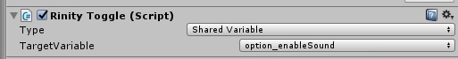
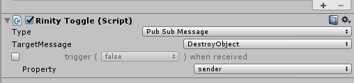
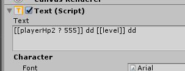
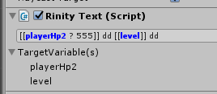

2-Way Binding
====

양방향 바인딩은 __UI 컴포넌트__와 __게임 스크립트__를 서로간에 바인딩해주는 역할을 합니다. 
이 기능을 이용하면 C#의 프로퍼티와 UI상에 표시되는 수치를 서로 바인딩함으로써, 일일히 상태 변경 리스터를 구독하거나, `.property_setter`를 통해 프로프티가 변경될 때 마다 UI 오브젝트에 변경을 통지해야 할 필요가 전혀 없습니다.

SharedVar에 바인딩하기
----

PubSubMessage에 바인딩하기
-----

단반향 바인딩
----
UI 컴포넌트 중에는 유저와의 인터렉션이 없는 오브젝트들도 존재합니다. 
예를들어 `Text`는 단순히 텍스트를 출력할 뿐 유저로부터 입력을 받기 위해서 만들어진 오브젝트가 아닙니다. 

 
