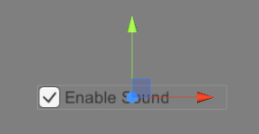
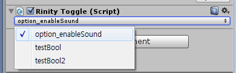
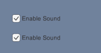

AutoBinding
====

__SharedVariables__ 기능은 게임 전역적으로 상태 혹은 값을 공유할 수 있도록 해주는 기능입니다.<br>
여기서는 __AutoBinding__기능과 __SharedVariables__을 이용하여, 게임 UI와의 양방향 바인딩을 수행하는 예제를 보여줍니다.<br>
<br>

기존 방법으로 Option 구현하기
----

<br>

```cs
class Options : MonoBehaviour {
    public static bool enableSound { get; set; }

    void Start() {
        Toggle toggle = GetComponent<Toggle>();

        toggle.onValueChanged.AddListener(OnToggleChanged)
    }

    void OnToggleChanged(bool isOn) {
        enableSound = isOn;
    }
}
```

```cs
class Player : MonoBehaviour {
    void Attack() {
        if (Options.enableSound) 
            PlaySound( SE.attack );

        /* .... */
    }
}
```

Rinity2를 사용하기
----

위에서 작성한 코드를 수정하여 `enableSound` 프로퍼티를 SharedVariables로 변경해 전역적으로 상태가 공유되도록 합니다.

```cs
class Options : MonoBehaviour {
    [SharedVariables("option_enableSound")]
    private bool enableSound { get; set; }

    /* enableSound를 다루기 위한 별도의 코드는 전혀 필요 없습니다. */
}
```
```cs
class Player : MonoBehaviour {
    [SharedVariables("option_enableSound")]
    private bool enableSound { get; set; }

    void Attack() {
        if (enableSound) 
            PlaySound( SE.attack );

        /* .... */
    }
}
```

기존에 만들어 두었던 `Toggle` 오브젝트에 `RinityToggle` 컴포넌트를 추가합니다.<br>
이는 해당 오브젝트에서 양방향 바인딩을 사용한다는것을 나타냅니다.<br>
<br>
컴포넌트가 추가되면 인스펙터에 자동으로 바인딩할 수 있는 변수의 목록이 표시됩니다.<br>

<br>

```
Rinity는 작성한 게임 스크립트에서 자동으로 SharedVariables 목록을 생성합니다. 
```

<br>
만약 `Player` 내부에 프로퍼티를 추가하는 방법이 싫다면 아래와 같이 값에 접근할 수 있습니다.
```cs
if (SharedVariables.Get("option_enableSound"))
    PlaySound( SE.attack ); 
```

응용하기
----
SharedVariables는 전역적으로 공유되는 값이기 때문에 두개의 __Toggle__에 동일한 변수를 바인딩하면 아래와 같은 효과도 만들 수 있습니다.
<br>